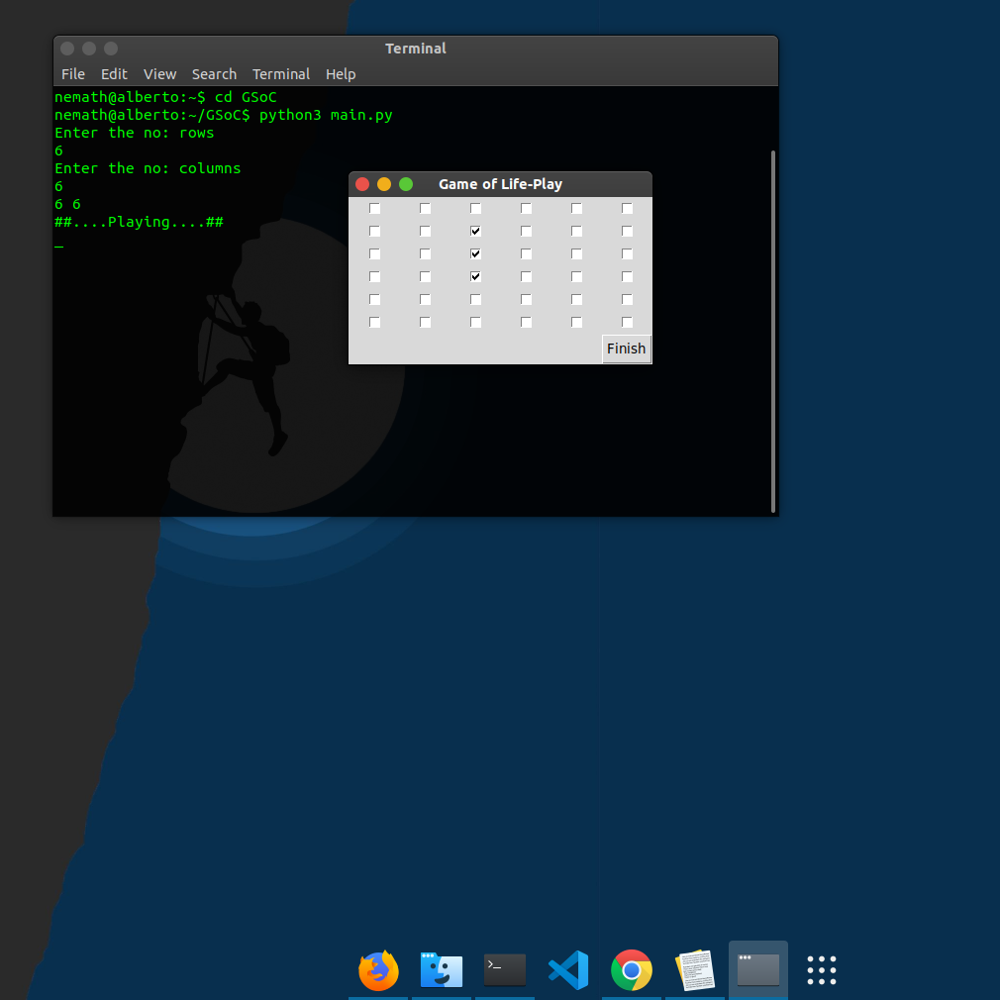

# gameoflife
Interactive Implementation of Game Of Life in Python  

As mentioned in the challenge, program is implemented using [python standard library](https://docs.python.org/3/library/).  
Under the standard library, I've used [tkinter module](https://docs.python.org/3/library/tk.html) to incorporate the GUI. 

After cloning the repo, you can directly start the game by running the following command from the command prompt.

```
python main.py
```

*If you have both python 2 and 3 installed, you might use the following command*  
```
python3 main.py
```
You will then be directed to enter the number of rows and columns for your gameboard.  
Let's say a gameboard with 6 rows and 6 columns

```
Enter the no: rows  
6  
Enter the no: columns  
6  
```
## Game Window

  

You can enter the patern that you wish to start with.  

## Playing window 

   
 

# Video Demos | Youtube
## [Demo video 1](https://youtu.be/qCt8cP_wqqI)  
## [Demo video 2](https://youtu.be/BjUMR6B52Ro)  
## [Demo video 3](https://youtu.be/N3fOD4dBgNU)  

The game starts with changing patterns.
The pattern used above is an oscillator which oscillates between two points.

*If you prefer not running using python3 command and want to run by python command, please change the line in gol.py where it calls goi-play.py*
